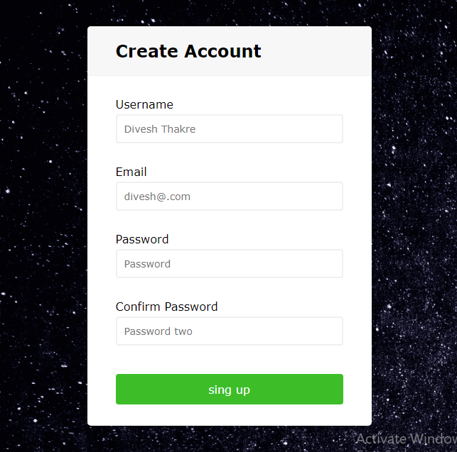

# Complete_Form_Validation
 by Divesh Thakre

In this project i have create Form validation which makes sure git  that user is filling the form carefully with relevent information.
### Technologies used
  
  

Preview

### Learnings
- Submit type EventListner 
- preventDefault() in javascript
- Properly writing conditions